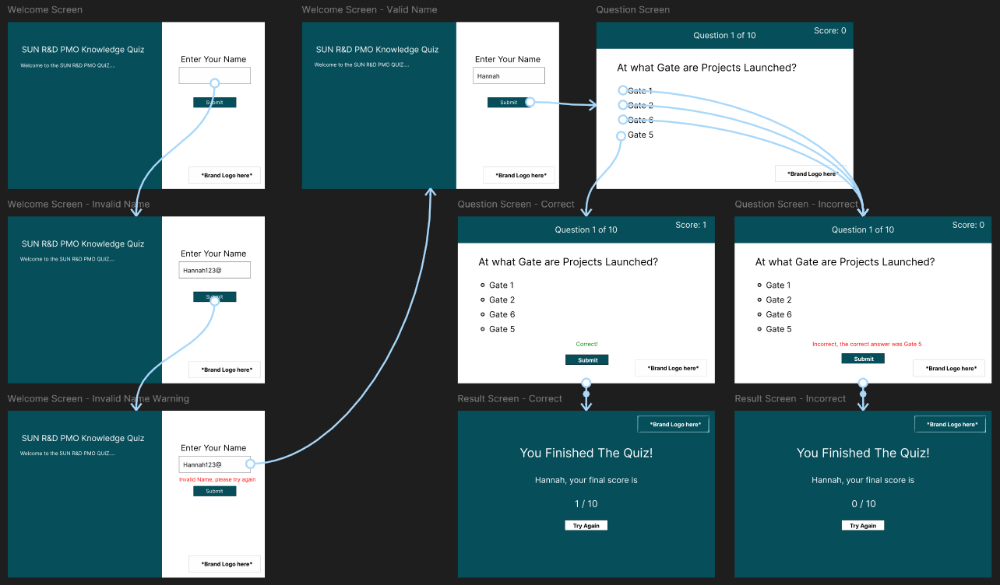
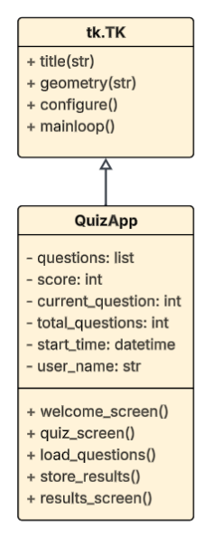
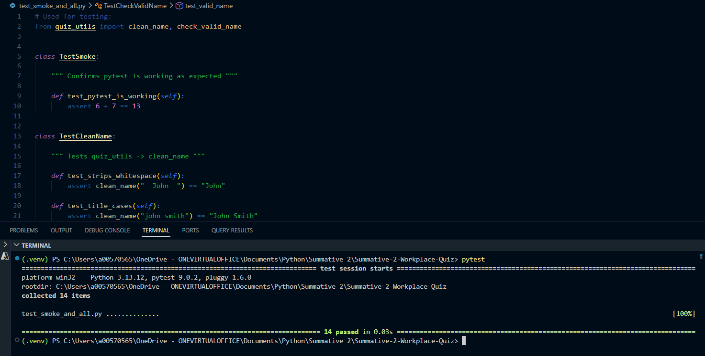

# SUN R&D PMO Multiple Choice Quiz

## Introduction

The SUN R&D PMO Multiple Choice Quiz is a minimum viable product (MVP) developed for the SUN Research and Development Project Management Office (PMO) at Edwards Vacuum, a child company of the Atlas Copco Group. The SUN R&D PMO team’s goals centres on maximising the efficiency and impact of the Semiconductor division engineering R&D portfolio, with a particular focus on harmonised project & programme management capability, processes, tools, reporting and governance to drive value by delivering insights and common working practices.

A key challenge facing the PMO is the decentralised nature of the organisation. Teams across the division have historically operated differently, using varied tools and following inconsistent procedures. To address this, the PMO has been working towards divisional standardisation by establishing common practices such as management tools and procedures. This drive for centralisation enables the PMO to create consistent insight reports which are applicable to many stakeholders thus avoiding duplicated effort for Portfolio and Project Managers across the division. 

The PMO team has been extremely impactful since creation and has led to a number of tools and procedures being developed and successfully implemented. However, innovation and change takes time to fully integrate. Ensuring both existing and new stakeholders are aware of the tools and confident in using them correctly is an ongoing challenge. This is the problem that the SUN R&D PMO Knowledge Quiz is designed to address.

The [Python](https://docs.python.org/3/) and [Tkinter](https://docs.python.org/3/library/tkinter.html) based quiz is used to test new and existing staff on their awareness of PMO tools and procedures, helping to reduce confusion, reduce knowledge decay and support faster onboarding. It collects a participant’s name and answers to a set of multiple choice PMO questions. Although the quiz is designed with a focused scope for the initial version, the incorrect answer options still reference real PMO tools and concepts. This means even a wrong answer becomes a learning opportunity by introducing participants to terminology and tools they may not yet know. Results are automatically saved, giving managers a record of participation and performance across the team.


## Design

### Prototype GUI Design
Before development began, [Figma](https://www.figma.com/design/) was used to draft an initial wireframe mapping the intended user journey, as seen in **Figure 1**. The wireframe shows the full journey of the quiz from entering a valid or invalid name, selecting and submitting answers to multiple choice questions, through to reaching the final score screen. It was used to define the layout, validation steps, and navigation flow early in the process. Rather than representing the final visual design, it focuses on structure, flow, and user interactions.



**Figure 1:** Initial Wireframe

The prototype can be viewed and clicked through here: [SUN R&D PMO Quiz Figma Prototype](https://www.figma.com/design/W4LokCV3ZugJ8cnO0uq0dS/Summative-2--Wireframe?node-id=0-1&p=f&t=Oqw63S86LBsiga43-0)

The design and branding intentionally uses Atlas Copco Group’s colour palette instead of Edwards Vacuum since the quiz is intended for stakeholders across the wider division, many of which sit outside of Edwards. Using the parent company’s brand identity ensures the tool is familiar and relevant to all users, especially since all other PMO tools follow Atlas branding.

### Functional and Non-functional Requirements

#### Functional Requirements

| ID  | Requirement  |
|-----|--------------|
| FR1 | The application must allow a user to enter their name. |
| FR2 | Name must be validated so that no numbers, special characters or blank submissions are allowed. |
| FR3 | Feedback must be displayed for invalid name entries. |
| FR4 | The application must display a set of single answer multiple choice PMO knowledge questions. |
| FR5 | User must select an option before being able to submit . |
| FR6 | Correct and incorrect answer feedback must be displayed after each submission. |
| FR7 | Score must be tracked and updated after each question is answered. |
| FR8 | Name, start time, end time and score reslts must be automatically saved to a CSV file. |
| FR9 | The results screen must show the final score / total questions. |
| FR10 | The application must allow the user to restart the quiz from the results screen. |

**Table 1:** Functional Requirements

#### Non-functional Requirements

| ID   | Requirement |
|------|-------------|
| NFR1 | The application must be consistent with Atlas Copco branding. |
| NFR2 | The application must handle invalid input without crashing. |
| NFR3 | Stored data should be readable using standard software. |
| NFR4 | The application should run on Windows with no additional dependencies beyond Python3 and pytest. |
| NFR5 | Questions must be updateable without running any code. |

**Table 2:** Non-functional Requirements

#### Tech Stack Outline

- [Python 3](https://docs.python.org/3/) - core programming language
- [Tkinter](https://docs.python.org/3/library/tkinter.html) - desktop graphical user interface (GUI)
- [csv](https://docs.python.org/3/library/csv.html) - local data storage in CSV format
- [re](https://docs.python.org/3/library/re.html) - regular expressions for input validation
- [datetime](https://docs.python.org/3/library/datetime.html) - timestamp generation
- [pytest](https://docs.pytest.org/en/stable/) - automated unit testing
- [os](https://docs.python.org/3/library/os.html) - file system interaction for checking file existence

#### Code Design



**Figure 2:** Initial Class Diagram

## Development

The quiz application is split across four Python modules to clearly define the responsibilities of each file. I wanted to ensure that the code was easy to understand for future developments so that it could be maintained or extended with extra user requirements.

- `main.py` - contains the `QuizApp` class and all GUI logic
- `quiz_data.py` - handles loading and formatting questions from the CSV file
- `quiz_utils.py` - contains all pure validation and answer checking functions
- `quiz_write_results.py` - handles writing quiz results to the CSV file

### `main.py` — Application Entry Point

The core of the application is the `QuizApp` class. It inherits from `tk.Tk` which means it is built on top of Tkinter's main window, giving it full control over the GUI. Key information such as the score, current question, and user name are stored directly on the class so they can be accessed from any method throughout the quiz.

```python
class QuizApp(tk.Tk):

    """ The class that represents the quiz application """

    def __init__(self):

        """ Sets up the app window, colour palate, images and quiz variables """

        super().__init__()

        self.user_name = None
        self.start_time = None
        self.score = 0
        self.current_question = 0
        self.correct_answer = None
```

The `clear_screen` method is used every time the application moves to a new screen. Instead of hiding and showing individual elements, it removes everything from the window and rebuilds the screen from scratch. This keeps the code for each screen simple and independent from the others.
```python
def clear_screen(self):

    """ Removes all widgets from the window """

    for widget in self.winfo_children():
        widget.destroy()
```

### `quiz_data.py` — Loading Questions

Before the quiz begins, questions are loaded from `questions.csv`. The `load_questions` function checks whether the file exists before trying to open it. If the file is missing, an error popup is shown to the user and the application closes cleanly instead of crashing.
```python
def load_questions(filepath="questions.csv"):

    """ Checks if questions.csv exists and if it doesn't produces an error. 
        If the file does exist then it reads the questions from questions.csv"""

    if not os.path.exists(filepath):
        raise FileNotFoundError(f"Questions file not found: '{filepath}'")

    with open(filepath, newline="", encoding="utf-8") as csvfile:
        reader = csv.DictReader(csvfile)
        rows = list(reader)

    return quiz_questions(rows)
```

Once loaded, the rows from the CSV are passed to `quiz_questions` which converts them into a structured format the application can use. The correct answer is also converted from 1-based (as written in the CSV) to 0-based (as Python counts from 0).
```python
def quiz_questions(rows: list[dict]) -> list[dict]:

    """ Converts csv rows into structured dictionaries and 
        changes correct answer index to start from 0 instead of 1"""

    return [
        {
            "question": row["question"].strip(),
            "options": [
                row["option_a"].strip(),
                row["option_b"].strip(),
                row["option_c"].strip(),
                row["option_d"].strip(),
            ],
            "correct": int(row["correct"]) - 1,
        }
        for row in rows
    ]
```

### `main.py` — Name Screen and `quiz_utils.py` — Validation

When the application launches, the user is presented with the name entry screen. When the user clicks Start Quiz, the name they entered is passed to `check_valid_name` in `quiz_utils.py` which checks it against three rules. If the name fails any of the checks, an error message is displayed beneath the entry field telling the user what to fix.
```python
def check_valid_name(name_entered: str) -> tuple[bool, str]:

    """ Checks the name is entered, contains no special 
        characters or numbers and is longer then 50 characters """

    stripped = name_entered.strip()
    if not stripped:
        return False, "Please enter your name."
    if len(stripped) > 50:
        return False, "Name must be 50 characters or fewer."
    if not re.fullmatch(r"[A-Za-z\s\-]+", stripped):
        return False, "Name must only contain letters, spaces, or hyphens."
    return True, ""
```

If the name passes all checks, it is passed to `clean_name` which removes any extra spaces and capitalises the first letter of each word. The score and question index are then reset and the quiz screen is built.
```python
def start_quiz(self):

    """ Makes sure the entered name is valid and starts the quiz """

    name_entered = self.name_entry.get()
    valid, message = check_valid_name(name_entered)

    if not valid:
        self.feedback_label.config(text=message, fg=self.error_colour)
        return

    self.user_name = clean_name(name_entered)
    self.start_time = datetime.now()
    self.score = 0
    self.current_question = 0

    self.build_quiz_screen()
    self.next_question()
```

### `main.py` — Quiz Screen

`next_question` displays the next question on the screen. If all questions have been answered it calls `end_quiz` instead.
```python
def next_question(self):

    """ Loads the next question onto the question screen or 
        ends the quiz if all questions have been answered """

    if self.current_question >= self.total_questions:
        self.end_quiz()
        return

    q = self.questions[self.current_question]
    self.correct_answer = q["correct"]
    self.progress_label.config(
        text=f"Question {self.current_question + 1} of {self.total_questions}"
    )
    self.question_label.config(text=q["question"])

    for i, option_text in enumerate(q["options"]):
        self.option_buttons[i].config(text=f"{chr(65+i)}: {option_text}")

    self.answer_var.set(-1)
    self.feedback_label.config(text="")
```

When the user clicks Submit, `check_answer` first checks that an option has been selected. It then passes the selected answer to `check_correct_answer` in `quiz_utils.py` which checks if it is correct and returns a feedback message. The score and feedback label are then updated accordingly.
```python
def check_correct_answer(selected: int, correct: int, options: list) -> tuple[bool, str]:

    """ Checks whether the answer is correct and displays 
        a feedback message including the correct answer if wrong"""

    if selected == correct:
        return True, "Correct!"
    correct_letter = chr(65 + correct)
    correct_text = options[correct]
    return False, f"Incorrect, the correct answer was {correct_letter}: {correct_text}"
```

### `quiz_write_results.py` — Saving Results


Once all questions have been answered, `end_quiz` calls `record_quiz_result` in `quiz_write_results.py` which adds a new row to `results.csv` with the user's name, start time, end time, score and total questions. The file is opened in append mode meaning existing results are never overwritten.
```python
def record_quiz_result(name, start_time, score, total_questions):

    """ Writes the users quiz results to the results.csv once the quiz is complete """

    with open("results.csv", mode="a", newline="", encoding="utf-8") as file:
        writer = csv.DictWriter(file, fieldnames=results_headers)
        writer.writerow({
            "name": name,
            "start_time": start_time.strftime("%Y-%m-%d %H:%M:%S"),
            "end_time": datetime.now().strftime("%Y-%m-%d %H:%M:%S"),
            "score": score,
            "total_questions": total_questions
        })
```

## Testing

### Testing strategy and methodology
Two main forms of testing were used for this application. Automated unit testing for logic functions and manual testing for the GUI and user journey. This combination was chosen because the two methods complement each other.

A structured manual test plan was executed to verify each screen, validation message and feedback label worked as expected. Alongside this, exploratory testing was carried out throughout development by freely clicking around the application to try and find unexpected behaviour or crashes.

All pure logic functions in `quiz_utils.py` and `quiz_data.py` are covered by automated unit tests written in pytest. GitHub Actions continuous integration was also configured to run the full test suite automatically on every push to the repository, ensuring any breaking changes are caught immediately.

### Outcomes of application testing

#### Manual Tests
The GUI cannot be tested automatically without additional tools, so manual testing was carried out instead. Additionally, exploratory testing was carried out throughout development by freely clicking around the application to try and find unexpected behaviour or crashes.

| Test Case ID | Functionality | Test Description | Expected Result | Actual Result | Pass/Fail |
|---|---|---|---|---|---|
| 1 | Layout | Launch the application and verify the name screen displays correctly | All aspects display in the correct position | Feedback label and frames were misaligned | Fail |
| 2 | Layout | Relaunch the application after fixing frame positioning | All aspects display in the correct position | All aspects displayed correctly | Pass |
| 3 | Name Screen | Submit a valid name e.g. "John Smith" and verify the quiz screen loads | Quiz screen loads and quiz begins | Quiz screen loaded as expected | Pass |
| 4 | Display | Answer a question and observe the next question loading | Next question displays fully within the window | Question text spilled over the window boundary and disappeared off screen | Fail |
| 5 | Display | Fix wraplength and retest question display | Next question displays fully within the window | Question displayed correctly within the window | Pass |
| 6 | Answer Validation | Click Submit without selecting an option | Error message: "Please choose an option before submitting." | Error message displayed as expected | Pass |
| 7 | Answer Checking | Answer several questions and verify the correct answer is being checked | Correct answer matches the selected option | Incorrect answers were being marked as correct due to 0-based index not being accounted for | Fail |
| 8 | Answer Checking | Fix index offset and retest answer checking | Correct answer matches the selected option | Correct answers marked correctly | Pass |
| 9 | Data | Answer a question and observe the answer options | Answer options display cleanly | Answer options displayed with unexpected leading spaces due to spaces after commas in `questions.csv` | Fail |
| 10 | Data | Remove extra spaces from `questions.csv` and retest | Answer options display cleanly | Answer options displayed cleanly as expected | Pass |
| 11 | Answer Feedback | Select the correct answer and click Submit | "Correct!" displayed in green | Feedback displayed as expected | Pass |
| 12 | Answer Feedback | Select an incorrect answer and click Submit | "Incorrect, the correct answer was X: [answer text]" displayed in red | Feedback displayed as expected | Pass |
| 13 | Navigation | Answer all questions | Result screen displays with correct final score | Result screen displayed as expected | Pass |
| 14 | Navigation | Click Try Again on the result screen | Name entry screen reloads and score resets to 0 | Name screen reloaded and score reset | Pass |
| 15 | Data Storage | Complete a quiz and check `results.csv` | New row added with name, start time, end time, score and total questions | Row added correctly | Pass |
| 16 | Error Handling | Delete `questions.csv` and launch the application | Error popup displayed and application closes | Popup displayed and application closed | Pass |
| 17 | Timing | Submit an answer and observe next question loading | Next question load gives enough time to read feedback label | Next question loaded too quickly | Fail |
| 18 | Timing | Add 1.8 second delay using `self.after(1800, self.next_question)` and retest | Next question load gives enough time to read feedback label | Next question load gave enough time to read | Pass |

**Table 3:** Manual Testing

#### Automated Tests

All pure functions in `quiz_utils.py` and `quiz_data.py` have automated unit tests written in pytest. The validation functions in `quiz_utils.py` take an input and return an output which means they can be tested directly by pytest without needing to run the application. pytest was chosen over unittest which is part of Python's standard library since it has cleaner syntax, more informative failure messages and better integration with GitHub Actions continuous integration which runs the tests automatically in the cloud for every push to the GitHub repository.



**Figure 3:** Passing pytests


## Documentation

### User Documentation
#### Step 1: Start / Run the Quiz
Once the quiz is set up on your local device, run the quiz. If you need help setting up the quiz please look to the Technical Documentation section below.

#### Step 2: Enter a Valid Name and Click Submit
Click into the entry box and type in your name. Please be aware that the application will not accept names with numbers, special characters (excluding hyphens) or if the name is exceeding 50 characters.

#### Step 3: Select One of the Four Answer Options and Click Submit
You should now see your first question!
Once you have selected the option that you believe is correct, click the submit button to lock in your answer.
You will then see a message to tell you whether you are correct or incorrect.
The page will then automatically move to the next question after a short period has passed.

#### Step 4: Continue the Quiz Until You Reach the Result Page
Continue the quiz until the questions run out.
You will then see an End Results screen which will display your final score.

#### Step 5: Either Retry the Quiz or Close the Application
Congratulations!!!
You finished the quiz!!!
Please either click the retry button to see if you can get a better score or close the application.

### Technical Documentation

#### How to Run the Program
To start working with the app you can clone the GitHub repository which involves taking a local copy for your computer to view, edit and run the project.

To download the GitHub repository, you can use command-line instructions in the terminal using the code below.
```bash
git clone https://github.com/blund-h/Summative-2-Workplace-Quiz.git
```

You then can paste the below code into the terminal to move inside of the folder you have just cloned.
```bash
cd Summative-2-Workplace-Quiz
```

Alternatively you can use Visual Studio Code to manually select the cloned app through 'File/Open Folder'.

#### Requirements
- [Python 3](https://docs.python.org/3/) - for Quiz
- [pytest](https://docs.pytest.org/en/stable/) - for running tests

#### How to Install pytest / Virtual Environment
Since pytest is an external Python library, you need to install it onto your computer. It is recommended to create a virtual environment first to avoid installing it to your global Python installation.

##### Installing Virtual Environment
Copy and paste the next steps one after the other in your terminal:
```bash
python -m venv .venv
```
```bash
.venv\Scripts\activate
```

##### Installing pytest
Once your virtual environment has been created, copy and paste the next step in your terminal:
```bash
pip install pytest
```

#### Running Tests
Once pytest is installed, run the following command from the terminal to run tests:
```bash
pytest
```

#### Code Structure

The application is split across four modules, each with a clearly defined responsibility:

| File | Responsibility |
|---|---|
| `main.py` | GUI and application flow |
| `quiz_data.py` | Loading and parsing questions from CSV |
| `quiz_utils.py` | Input validation and answer checking logic |
| `quiz_write_results.py` | Writing quiz results to CSV |

**Table 4:** All Application Files

All testable logic is kept in `quiz_utils.py` as pure functions with no side effects, meaning they can be tested in isolation without requiring a running GUI. This is what allows the automated tests in `test_quiz_utils.py` to run in a CI pipeline via GitHub Actions without a display.


## Evaluation
Overall, I am very pleased with this project since it has successfully delivered a functional, tested, and maintainable quiz that addresses a genuine need within the SUN R&D PMO. Reflecting on the development process, there are a number of things that I think went well but also some areas that could be improved in a future iteration.

One of the aspects I am most pleased with is the design of the GUI. I believe the deliberate integration of the Atlas Copco branding was essential to ensure the quiz feels familiar and professional to all of the PMO team's wider audience. Since many of the PMO's tools follow the same branding, it ensures this quiz is aligned with the standards established within the team, creating an extension of the existing tools rather than a standalone application. I am also pleased that there are clear distinctions between the home page, question page and result page through the use of carefully placed frames to create modern and clean designs that guide the user through the tool.

During planning, I had initially decided to have all the `quiz_utils`, `quiz_data` and `quiz_write_results` functions inside the `QuizApp` class. However, as I started coding, I found that it became unclear and messy. Moving the functions into separate files was the correct decision and made the project significantly easier to develop and will help future maintenance. Having `quiz_utils.py` dedicated entirely to pure validation functions meant that testing was straightforward and the GUI code in `main.py` remained clean and focused on presentation rather than logic.

I believe choosing to store the questions in a CSV file rather than hardcoding them was a practical design choice made during development. It means that any member of the PMO team can add, remove, or update questions without needing to dive deep into any code which increases the sustainability and longevity of the tool. I do however believe that as further development I could put additional checkers to make sure the questions / answers file is filled in correctly. Otherwise it risks a small human error potentially crashing the app.

Reflecting on what could be improved, one of the features that I think could be improved on is that the questions and answer options are always presented in the same fixed order. This means that repeated attempts offer very little additional challenge, as users may begin to remember answer positions rather than genuinely recalling the correct answer. In future development I would like to implement randomisation of the question order and also the answer options to make the quiz more effective as a knowledge testing tool.

Another limitation is that stakeholders currently have no way to view results within the application itself, instead they have to open `results.csv` manually in their file explorer or in a spreadsheet application. I think adding a simple results viewer screen within the app or even a leaderboard of the top 10 scores would make it far more practical for managers to monitor team participation and performance without needing to leave the application.

Finally, while the application has been manually tested and all logic functions are covered by automated unit tests, I was not able to do any formal user testing. User testing with real stakeholders would most likely surface new user requirements, usability improvements or even changes to the default questions displayed that are unfortunately difficult to identify as the developer even when trying to think from the stakeholder's point of view. It is definitely something I would like to pursue in future developments.
